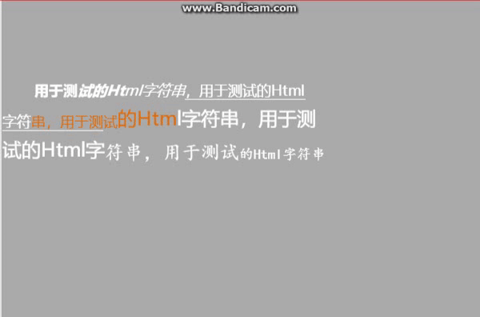

# htmlcompnent
基于layaair H5引擎封装，跑马灯效果。

<h1>示例效果：</h1>




<h1>使用方法：</h1>

```ts
	//初始化跑马灯
    public initRollingMsg(src_conf:string):void
    {
        var msg = RollingMsg.getInstance(src_conf,this,this.onRollingMsgCreated);

        Laya.stage.addChild(msg);
    }
	
    //跑马灯初始化完毕之后
    public onRollingMsgCreated(obj:RollingMsg):void
    {
        var datas = [
            {"notice":"<em>这是第一条消息;  </em>"},
            {"notice":"这是第<span style='color:#ff0000;'>2</span>条消息;  "},
            {"notice":"这是<span style='color:#ffff00;'>第3条</span>消息;  "},
            {"notice":"这是<span style='text-decoration: underline;'>第四条</span>消息;  "},
        ];
        obj.addMsgItems(datas);
        obj.startScrollingTimer();
    }
```

